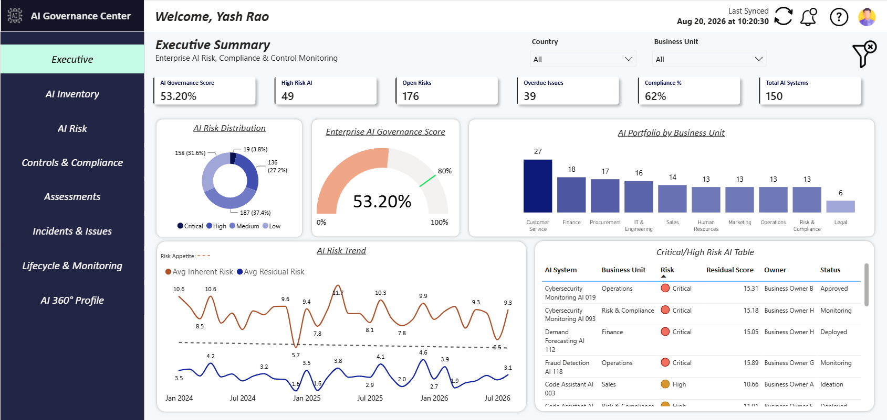
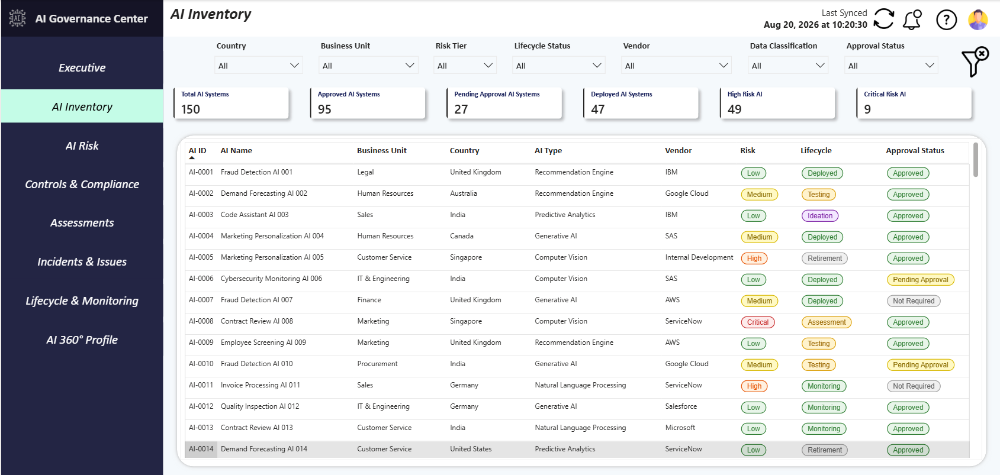
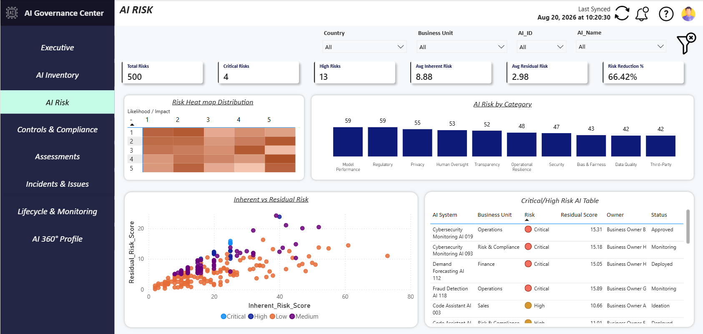
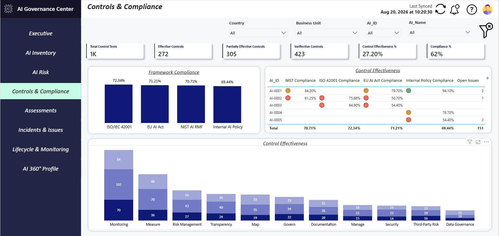
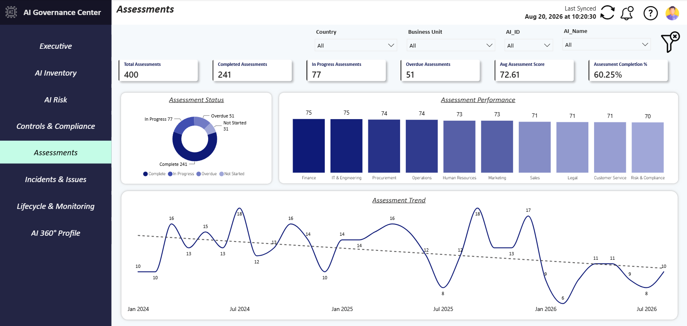
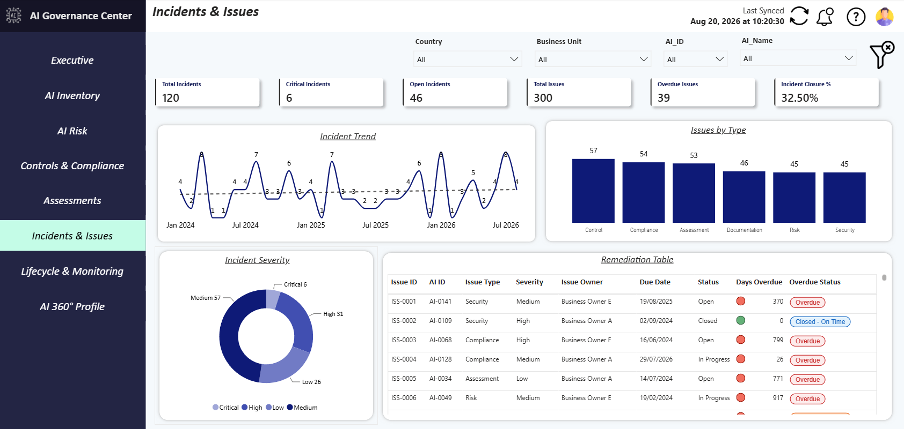
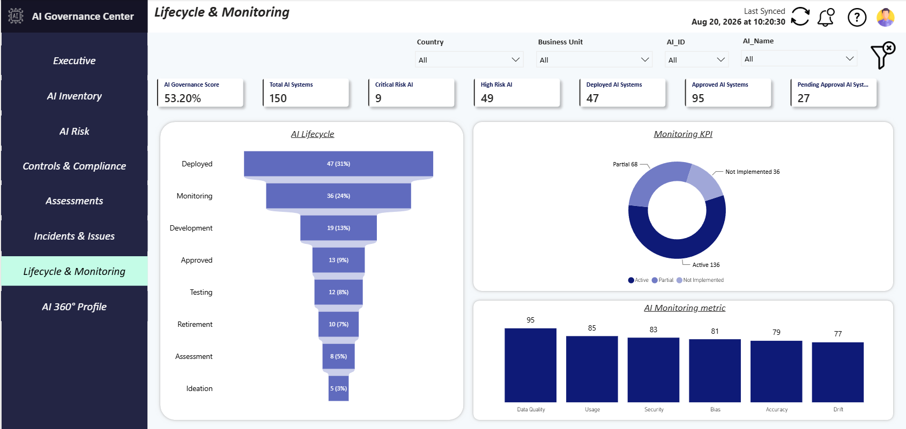

# 🤖 AI Governance Command Centre

<div align="center">

### Enterprise AI Governance, Risk & Compliance Analytics

**Built with Microsoft Power BI | DAX | Power Query | Data Modeling**

[](https://powerbi.microsoft.com/)
[](https://learn.microsoft.com/dax/)
[]()
[]()
[]()
[]()

</div>

---

An enterprise-style **AI Governance, Risk & Compliance dashboard** built using **Microsoft Power BI**.

The project provides a centralized view of AI systems, risk, controls, compliance, assessments, incidents, remediation and monitoring.

> **RWFD — Real World Fake Dataset**  
> All data used in this project is synthetic and created for demonstration purposes.

---

## 📊 Dashboard Overview

The solution consists of the following Power BI pages:

| Page | Overview |
|---|---|
| 🏠 **Executive Command Centre** | High-level view of AI governance, risk, compliance and key governance KPIs |
| 🗂️ **AI Inventory** | Centralized inventory of AI systems, owners, use cases, vendors and lifecycle |
| ⚠️ **AI Risk** | Inherent vs. residual risk, risk categories and risk heatmap |
| 🛡️ **Controls & Compliance** | Control effectiveness and compliance across AI governance frameworks |
| 📋 **Assessments** | AI assessment scores, status, reviews and overdue assessments |
| 🚨 **Incidents & Remediation** | AI incidents, open issues, overdue actions and remediation tracking |
| 🔄 **Lifecycle & Monitoring** | AI lifecycle stages and ongoing monitoring of deployed AI |
| 🔎 **AI 360° Profile** | Detailed drill-through view of an individual AI system |

---

## 🖼️ Dashboard Preview

### Executive Command Centre


### AI Inventory


### AI Risk


### Controls & Compliance


### Assessments


### Incidents & Remediation


### AI Lifecycle Monitoring


### AI 360 Profile – Detail 1


### AI 360 Profile – Detail 2


---

## 🛠️ Technology

- Microsoft Power BI
- DAX
- Power Query
- Data Modeling
- Excel
- GitHub

---

## 🎯 Key Capabilities

- AI Portfolio & Inventory Management
- AI Risk Management
- Inherent vs. Residual Risk
- Control Effectiveness
- Compliance Matrix
- AI Assessments
- Incident & Issue Management
- Overdue Remediation Tracking
- AI Lifecycle Management
- AI Monitoring
- AI 360° Governance Profile

---

## 📚 Governance Frameworks

The dashboard includes illustrative governance views based on:

- NIST AI RMF
- ISO/IEC 42001
- EU AI Act
- Internal AI Governance Policy

---

# 🏗️ Solution Architecture

```text
                    AI GOVERNANCE ECOSYSTEM
                             │
              ┌──────────────┴──────────────┐
              │                             │
        AI INVENTORY                   GOVERNANCE
              │                             │
              │                    ┌────────┼─────────┐
              │                    │        │         │
              │                  Risk    Controls  Compliance
              │                    │        │         │
              └──────────────┬─────┴────────┴─────────┘
                             │
                       DATA MODEL
                             │
                       POWER QUERY
                             │
                            DAX
                             │
                       POWER BI
                             │
              ┌──────────────┼──────────────┐
              │              │              │
           Executive        Risk        Compliance
          Command Centre   Analytics      Monitoring
              │              │              │
              └──────────────┼──────────────┘
                             │
                       AI 360° PROFILE

```

---

# 🗂️ Data Model

The solution uses a structured relational data model connecting AI inventory, risks, controls, assessments, incidents, remediation and lifecycle data.

```text
                         AI GOVERNANCE DATA MODEL
                                  │
                                  │
                         ┌────────▼────────┐
                         │   AI INVENTORY   │
                         │──────────────────│
                         │ AI_ID (PK)       │
                         │ AI_Name          │
                         │ AI_Type          │
                         │ Business_Unit    │
                         │ Owner_ID (FK)    │
                         │ Lifecycle_ID(FK) │
                         │ Risk_Rating      │
                         │ Status           │
                         └────────┬─────────┘
                                  │
              ┌───────────────────┼────────────────────┐
              │                   │                    │
              │                   │                    │
       ┌──────▼──────┐     ┌──────▼──────┐      ┌──────▼─────────┐
       │ AI LIFECYCLE│     │  AI RISKS   │      │  ASSESSMENTS   │
       │─────────────│     │─────────────│      │────────────────│
       │ Lifecycle_ID│     │ Risk_ID (PK)│      │ Assessment_ID  │
       │ Stage       │     │ AI_ID (FK)  │      │ AI_ID (FK)     │
       │ Start_Date  │     │ Likelihood  │      │ Assessment_Type│
       │ End_Date    │     │ Impact      │      │ Score          │
       │ Status      │     │ Inherent_Risk│     │ Status         │
       └─────────────┘     │ Residual_Risk│     │ Assessment_Date│
                           │ Risk_Status  │      └────────────────┘
                           └──────┬──────┘
                                  │
                         ┌────────▼────────┐
                         │ RISK TREATMENT  │
                         │─────────────────│
                         │ Treatment_ID    │
                         │ Risk_ID (FK)    │
                         │ Action          │
                         │ Owner_ID (FK)   │
                         │ Due_Date        │
                         │ Status          │
                         └────────┬────────┘
                                  │
                                  │
              ┌───────────────────┼────────────────────┐
              │                   │                    │
       ┌──────▼──────┐     ┌──────▼───────┐     ┌─────▼──────────┐
       │  CONTROLS   │     │  INCIDENTS   │     │ REMEDIATION    │
       │─────────────│     │──────────────│     │────────────────│
       │ Control_ID  │     │ Incident_ID  │     │ Remediation_ID │
       │ Control_Name│     │ AI_ID (FK)   │     │ AI_ID (FK)     │
       │ Control_Type│     │ Severity     │     │ Control_ID(FK) │
       │ AI_ID (FK)  │     │ Category     │     │ Issue          │
       │ Effectiveness│    │ Incident_Date│     │ Action         │
       │ Status      │     │ Status       │     │ Owner_ID (FK)  │
       └──────┬──────┘     └──────────────┘     │ Due_Date       │
              │                                  │ Status         │
              │                                  └────────────────┘
              │
       ┌──────▼──────────────┐
       │ CONTROL ASSESSMENTS  │
       │──────────────────────│
       │ Control_Assessment_ID│
       │ Control_ID (FK)      │
       │ Assessment_ID (FK)   │
       │ Test_Result          │
       │ Effectiveness_Score  │
       │ Finding              │
       └──────────────────────┘


                    SHARED DIMENSIONS
                    ──────────────────

       ┌──────────────┐   ┌──────────────┐   ┌──────────────┐
       │    OWNER     │   │ ORGANIZATION │   │     DATE     │
       │──────────────│   │──────────────│   │──────────────│
       │ Owner_ID PK  │   │ Org_ID PK    │   │ Date_Key PK  │
       │ Owner_Name   │   │ Business_Unit│   │ Date         │
       │ Role         │   │ Department   │   │ Month        │
       │ Department   │   │ Region       │   │ Quarter      │
       └──────┬───────┘   └──────┬───────┘   │ Year         │
              │                  │             └──────┬───────┘
              │                  │                    │
              └──────────────────┼────────────────────┘
                                 │
                         CONNECTED TO FACTS
 ```

---

⚠️ Disclaimer

This project uses **synthetic data** and is intended for portfolio, learning and demonstration purposes only.

It does not represent real organizational AI systems, risks, controls, incidents or compliance assessments.

---

## 👨‍💻 Author

**Yash Kumar Rao**

Risk & Data Analytics | Power BI | AI Governance | GRC | Risk Management
